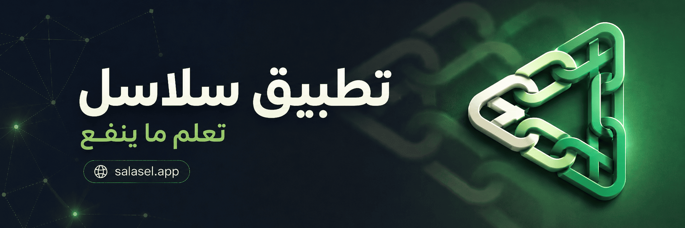

# تطبيق سلاسل

**تطبيق سلاسل** تطبيق شبكي يقدّم قوائم تشغيل مختارة بعناية من YouTube لبناء الإنسان، مع ملاحظات ذاتية مرتبطة بزمن كل لقطة داخل المقطع، ونظام تتبّع للتقدّم في القوائم ومقاطعها

## ماذا يقدم سلاسل؟

ينطلق **تطبيق سلاسل** من فهم عميق لاحتياجات الشباب المعاصر، ويقدّم محتوى يخاطب الإنسان ككل عبر أربعة مرتكزات أساسية:

1. **الفطرة السليمة**
2. **الإيمان الإسلامي**
3. **النفس الإنسانية**
4. **الصحة الجسدية**

> سلاسل ليست محتوى عشوائياً، بل رحلة بناء نحو إنسان متوازن

## ادعمنا

## تابعنا

## للتواصل

contact@salasel.app

